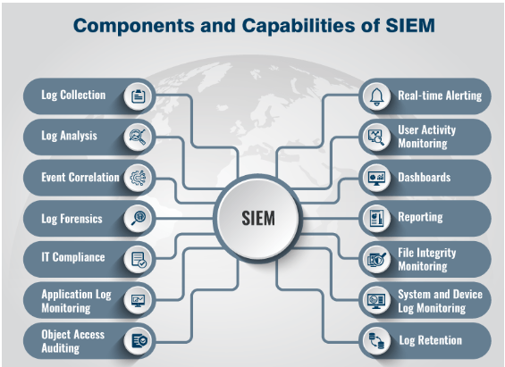

# Security information and event management (SIEM)

## Security information and event management (SIEM)

## **Why is SIEM important**?
It would be an understatement to say that the number of cyberattacks has been massively increasing in recent times, breaching the walls of organizations across the world, invading their privacy, and leaving them defenseless. Security information and event management software are a must-have for any security-conscious business. 

A perfectly configured SIEM system will react quickly if an abnormal event occurs. It not only monitors activities in a network environment but also analyzes events, alerts users, and takes automated action to detect and respond to cyber security threats and vulnerabilities before they wreak havoc.

SIEM programming works by gathering log and event data created by various applications, security gadgets, and host frameworks and uniting it into a unified platform. SIEM implementations provide unified alerts, advanced full-packet logging capabilities, and intelligent correlation to enhance security operations.

## **Why Should Your Business Use SIEM**?
One of the main reasons organizations use SIEM is because it's nearly impossible to effectively manually monitor the vast amount of data that cyber security tools generate. A SIEM system filters through all the data and prioritize alerts, making security more manageable.

And given that log management is at the core of SIEM, as more logs from cyber security sources get fed into the SIEM system, the more it generates actionable reports. This feature enables SIEM to compare relevant events by cross-referencing logs from multiple sources.

## **What Is Security Information and Event Management (SIEM), and Why Is It Important to Your Business**?
One of the main reasons organizations use SIEM is because it's nearly impossible to effectively manually monitor the vast amount of data that cyber security tools generate. A SIEM system filters through all the data and prioritizes alerts, making security more manageable.

And given that log management is at the core of SIEM, as more logs from cyber security sources get fed into the SIEM system, the more it generates actionable reports. This feature enables SIEM to compare relevant events by cross-referencing logs from multiple sources.

- Detect Incidents You May Not Have Known About Otherwise
- Respond to Security Incidents More Effectively
- Improve Your Security Posture
- Meet Compliance Regulations or Insurance Requirements
- Increase Efficiency, Save Time and Money

## 1. **Detect Incidents You May Not Have Known About Otherwise**
SIEM solutions allow businesses to detect threats that may otherwise go undetected.
For example, SIEM analyzes log entries to identify signs of malicious activities. It gathers events from multiple sources across a network and recreates the timeline of an attack. This feature enables businesses to determine the nature of an attack.
Otherwise, the events might go unnoticed.

## 2. **Respond to Security Incidents More Effectively**
SIEM makes it easier and faster for your team to identify and react to potential threats by centralizing your cyber security data.
A SIEM system enhances cyber incident management by:
Uncovering the route an attack takes across the network.
Identifying compromised sources.
Providing automation to stop attacks in progress.

## 3. **Improve Your Security Posture**
SIEM provides a single pane of glass for security data from across the IT environment and analyzes it for signs of threats. This visibility into all network activity helps identify potential vulnerabilities and risks and take steps to remedy them before they’re exploited.

## 4. **Meet Compliance Regulations or Insurance Requirements**
Since a SIEM system generates reports on all the logged security events, it can help organizations meet compliance requirements like CMMC and NIST. Without SIEM, organizations would have to collect log data and manually compile reports. This can be a difficult (if not impossible) task.
Requirements for cyber liability insurance are increasing. While SIEM isn't a common requirement yet in most industries, having it in place will help you get better rates since you're doing more to prevent a loss.

## 5. **Increase Efficiency, Save Time and Money**
SIEM helps reduce the time it takes to investigate and resolve incidents since all the relevant information is available in one place. SIEM also automates routine tasks, such as log collection and correlation, which reduces the workload of cyber security teams.

# **Benefits of SIEM**.

## ****Visibility****.
A modern SIEM provides real-time status updates into your security posture — retrieving and maintaining contextual data around users, devices and applications from across on-premises, cloud, multicloud and hybrid environments. This makes it easier for security analysts to spot bad actors and zero in on threats.

## ****False alerts****. 
A SIEM solution can help reduce the number of false positive alerts, so security analysts can quickly detect and investigate actual threats and not waste time on false alerts. Potential threats are identified, categorized and triggered via dashboards, then sent to an analyst for review.

## ****Flexibility and scalability****.
Many SIEM solutions offer support for and integrate with a wide array of environments and technologies, as well as across internal and external teams. A modern SIEM can meet your needs now and in the future, especially as your tech footprint expands.
In all, the benefits of SIEM help enterprises prevent costly breaches and avoid compliance violations that entail hefty financial penalties and reputation loss.

## **Reference:-**

How Confluent Can Help Optimize and Modernize Your SIEM for Better Cybersecurity

[**confluent-vlog**](https://www.confluent.io/blog/siem-optimization-for-better-cyber-security/)

[**suricata-intrusion-detection-prevention-linux**](https://www.tecmint.com/suricata-intrusion-detection-prevention-linux/)

